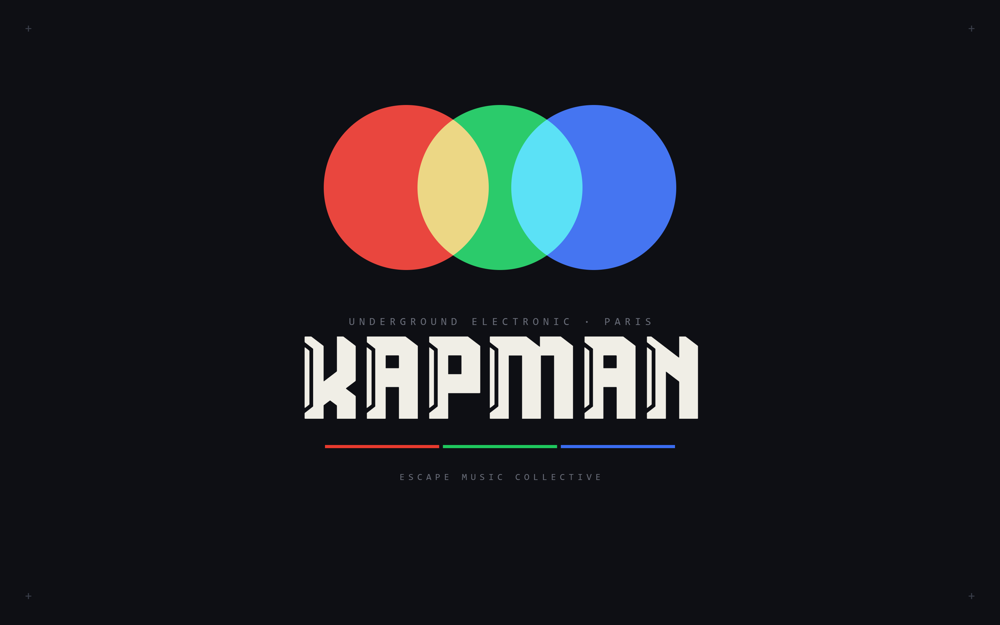

# KAPMAN SIGNAL — Underground Electronic Newsletter

> **A music newsletter that pushes to your phone — no app, no email, one tap.**
> Curated underground electronic selections, delivered as native web-push notifications. Scan a QR, get every issue.

### → [**Read the latest issue**](https://arochab.github.io/kapman-news/) · [Subscribe (Chrome Android)](https://arochab.github.io/kapman-news/)



Email newsletters get their CSS stripped and land in Promotions. KAPMAN SIGNAL takes the opposite route: each issue is a **self-hosted web page** with a full design system, and distribution runs on the **Web Push standard** — the same notifications a native app would send, but with zero install. A reader scans the QR code, taps *Subscribe* once, and every new issue arrives as a push notification straight to the lock screen.

Built for the **Escape Music Collective** (Paris). Free to run end to end.

---

## How it works

A static site + a tiny push server, glued by the Web Push standard:

```
   git push issues/NN/        ─►  GitHub Actions  ─►  /notify (Render)
                                                            │
   reader scans QR  ─►  Subscribe (1 tap)                   │ Web Push (VAPID)
        │                      │                            ▼
        ▼                      ▼                    Chrome Android push
   GitHub Pages          Render server  ◄──►  GitHub Gist (subscriber store)
   (the issue page)      (Flask + pywebpush)     (durable, free)
```

1. **Issues are static pages.** Each issue is rendered from a Jinja2 template into `issues/NN/index.html` and served by **GitHub Pages** — full dark design system, mobile-first, instant load.
2. **Subscribing is one tap.** A service worker registers at the site root; the reader grants permission once and a Web Push subscription (VAPID) is created — **no app, no account**.
3. **Subscribers live in a private Gist.** The Flask server on **Render** stores push subscriptions in a GitHub Gist via the API — durable and free, surviving the free tier's ephemeral disk.
4. **Publishing sends the notification.** Pushing a new `issues/NN/index.html` triggers a **GitHub Action** that calls the server's `/notify` endpoint, which delivers a Web Push to every subscriber.

## Design system

KAPMAN's identity is built into every page — not bolted on:

- **Palette** — Ink `#0D0D0D` · Cream `#F5F0E8` · Red `#E8372A` · Green `#00A650` · Blue `#2F57D4`
- **Logo** — three additive-light circles (red/green/blue overlapping to white), rendered as inline SVG so it survives anywhere
- **Type** — Space Grotesk, tight tracking, uppercase micro-labels
- **Tone** — euphoric · physical · precise. No filler, no hype.

The same system drives the PWA icons (generated from the logo) and the notification badges.

## Run it locally

```bash
git clone https://github.com/arochab/kapman-news.git
cd kapman-news

# --- Front end: just open the static site ---
python -m http.server 8000   # → http://localhost:8000

# --- Push server (optional) ---
pip install -r server/requirements.txt
python tools/generate_vapid_keys.py     # one-time: VAPID keypair
cp .env.example .env                     # fill in the keys
python server/app.py                     # → http://localhost:5000
```

The site renders fully without the server — the server is only needed to store subscriptions and send notifications.

## Authoring a new issue

```bash
python tools/new_issue.py --num 10            # scaffold content/10.json
#   → fill in tracks, labels, studio notes (real links only)
python tools/new_issue.py --num 10 --build    # render the page + update the index
git add -A && git commit -m "KAPMAN SIGNAL N°10" && git push
#   → GitHub Action pushes the notification automatically
```

Content lives in `content/NN.json` (schema in [`content/SCHEMA.md`](content/SCHEMA.md)); the design is guaranteed identical across issues because every page comes from `templates/issue.html.j2`.

## Tech & skills demonstrated

- **Web Push from scratch** — VAPID keypair, service worker at correct scope, `pushManager.subscribe`, server-side `pywebpush` delivery, dead-subscription cleanup.
- **PWA** — installable manifest, offline-tolerant service worker, generated maskable icons.
- **Zero-cost durable backend** — a private GitHub Gist used as a database, sidestepping Render free's ephemeral disk.
- **CI as a publishing pipeline** — GitHub Actions turns `git push` into a fan-out notification.
- **Templating & design systems** — one Jinja2 template, JSON-driven content, a brand system reproduced in pure HTML/SVG/CSS.
- **Full-stack** — Flask + vanilla JS, deployed on Render with gunicorn; static front on GitHub Pages.

## Repo map

```
index.html              landing + issue list
issues/NN/index.html    rendered issues
templates/issue.html.j2 the single source of design truth
content/NN.json         issue content (+ SCHEMA.md)
pwa/                    manifest, service-worker client, icons, QR
service-worker.js       push + cache (served from root for full scope)
server/app.py           Flask push server (Render)
tools/                  build_issue · new_issue · generate_icons · generate_qr · send_push · generate_vapid_keys
.github/workflows/      notify.yml — push on publish
```

## License

[MIT](LICENSE) · Built by [Adam Chabbi](https://github.com/arochab) for [Escape Music Collective](https://arochab.github.io/kapman-news/)
